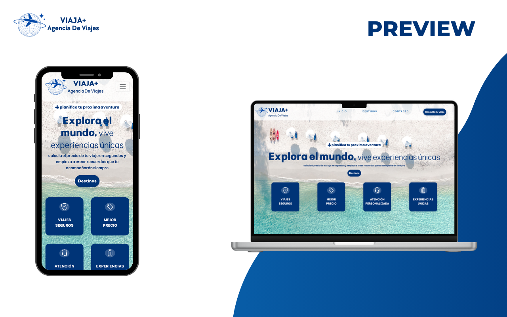
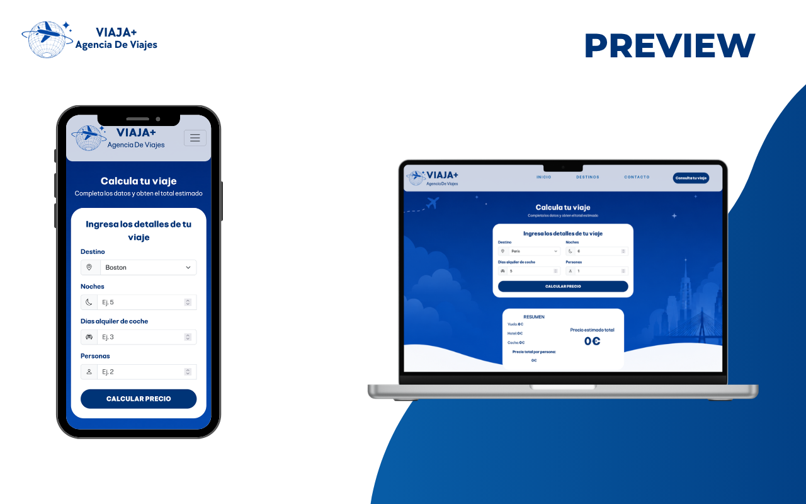
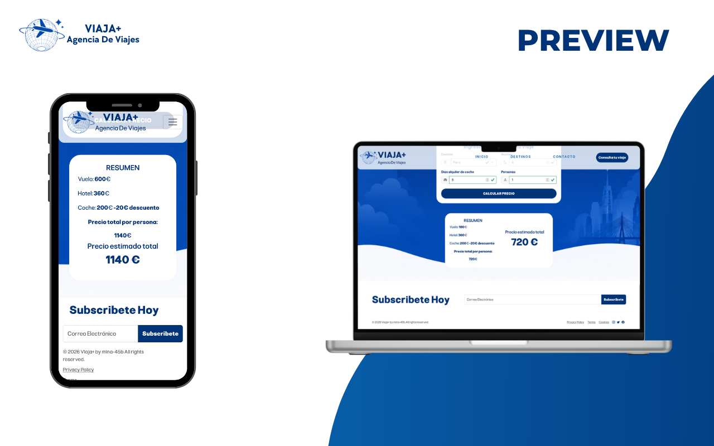

# VIAJA+ - Agencia de Viajes

**Viaja+** es un sitio web estático de una agencia de viajes desarrollado como proyecto de demostración para mostrar el uso de **Bootstrap 5.3** y sus componentes principales.

## Objetivo

Este proyecto fue creado con fines educativos para demostrar la implementación práctica de Bootstrap en una interfaz web real, abarcando desde el sistema de grillas hasta componentes avanzados como carruseles, modales, offcanvas y formularios con validación.

## Características

- **Navbar responsive** con efecto glass (blur) y menú colapsable
- **Hero section** con tarjetas de servicio animadas (efecto 3D flip)
- **8 destinos turísticos** con carruseles de imágenes individuales (Boston, Londres, París, Roma, Sevilla, Río de Janeiro, Kioto, Buenos Aires)
- **Calculadora de viaje interactiva** que estima costos de vuelo, hotel y alquiler de coche
- **Formulario de contacto** en modal con validación de Bootstrap y toast de confirmación
- **Offcanvas** con información de contacto y mapa embebido de Google Maps
- **Modales** para términos y condiciones y políticas de privacidad
- **Diseño responsive** adaptado a móviles, tablets y escritorio
- **Optimización de rendimiento**: lazy loading, precarga de imágenes críticas, spinners de carga y `content-visibility`

## Vista previa

<figure>
  
  <figcaption>Menú Inicio</figcaption>
</figure>

<figure>
  
  <figcaption>Menú Destinos</figcaption>
</figure>

<figure>
  
  <figcaption>Formulario de Calculo de viaje</figcaption>
</figure>

<figure>
  
  <figcaption>Precio del viaje y Menú footer</figcaption>
</figure>


## Tecnologías

- **HTML5** semántico
- **CSS3** con variables personalizadas, animaciones y media queries
- **Bootstrap 5.3** (CDN) - sistema de grillas, componentes y utilidades
- **Bootstrap Icons** - librería de iconos
- **JavaScript vanilla** - interactividad del carrusel, validación de formularios y cálculo de presupuesto
- **Google Fonts** - tipografía Pliant

## Estructura del proyecto

```
viajaBootstrap/
├── index.html          # Página principal
├── css/
│   └── style.css       # Estilos personalizados
├── js/
│   └── main.js         # Lógica de la aplicación
├── assets/
│   ├── icons/          # Iconos SVG y PNG
│   ├── images/
│   │   ├── backgrounds/   # Imágenes de fondo
│   │   ├── Boston/
│   │   ├── Londres/
│   │   ├── Paris/
│   │   ├── Roma/
│   │   ├── Sevilla/
│   │   ├── Rio/
│   │   ├── Kioto/
│   │   └── Buenos-aires/
│   └── svg/
└── data.md             # Documentación de optimización de carga
```

## Componentes Bootstrap utilizados

- Navbar (`navbar`, `navbar-expand-lg`, `navbar-toggler`)
- Carrusel (`carousel`, `carousel-item`, `carousel-controls`, `carousel-indicators`, `slide.bs.carousel`)
- Cards (`card`, `card-body`, `card-img-top`)
- Modal (`modal`, `modal-dialog`, `modal-body`, `modal-footer`)
- Offcanvas (`offcanvas`, `offcanvas-body`, `offcanvas-header`)
- Formularios (`form-control`, `form-select`, `form-check`, `input-group`, `was-validated`)
- Toast (`toast`, `toast-header`, `toast-body`)
- Badge (`badge`, `rounded-pill`)
- Spinner (`spinner-border`)
- Sistema de grillas (`container`, `row`, `col-*`, `row-cols-*`)
- Utilidades de padding, margin, flexbox, tipografía y colores

## Cómo usar

1. Abre `index.html` en tu navegador (no requiere servidor).
2. Navega por los destinos y haz clic en **"Consultar"** para abrir la calculadora.
3. Completa los datos del viaje y haz clic en **"Calcular precio"** para obtener un presupuesto estimado.

---

Desarrollado por [mina-45b](https://github.com/mina-45b) como proyecto de demostración de Bootstrap.
